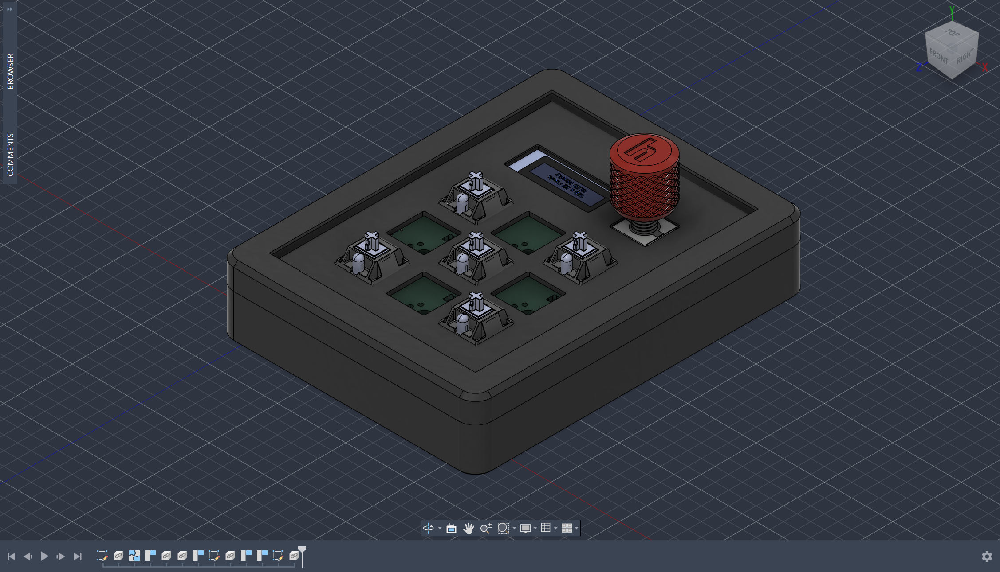
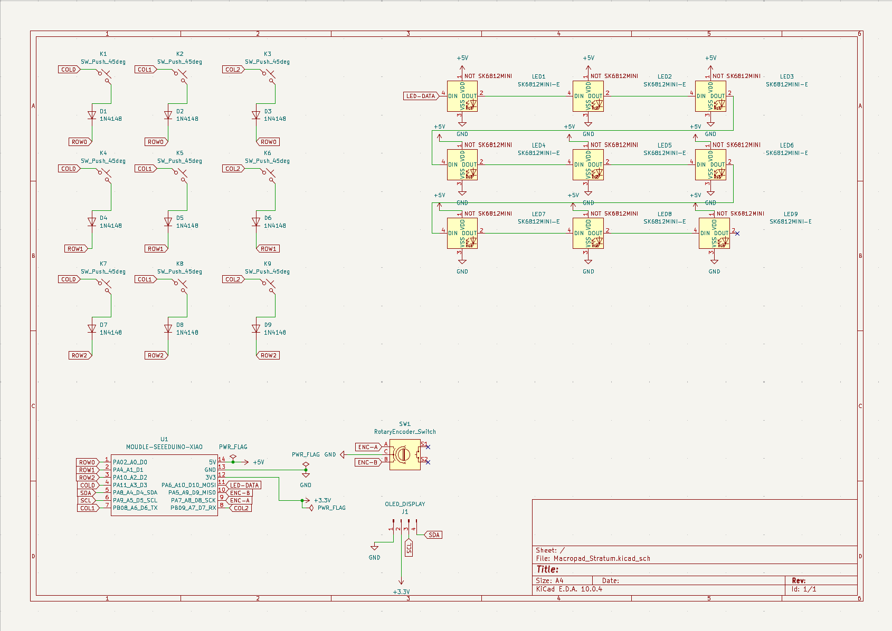
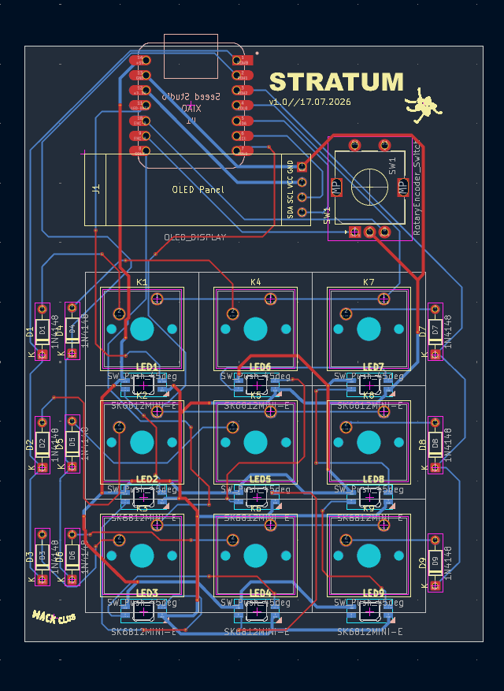
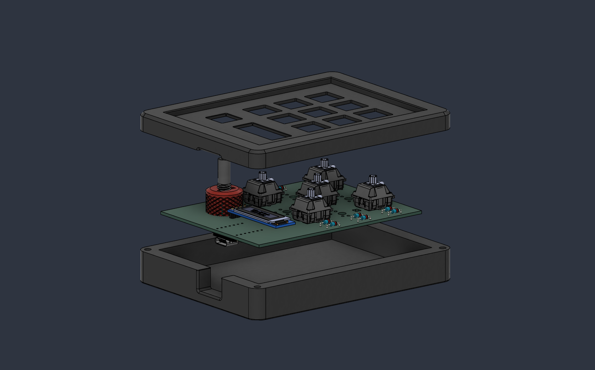

# Stratum 
Stratum is a 9-key personal macropad creation with a rotary encoder, an OLED display and RGB backlighting under each key that uses QMK firmware. It supports five independent layers, allowing each key to perform a unique function depending on the active layer. Stratum was made as a submission for Hackpad v5 through HackClub's Stardance Challenge.

## Features:
- 0.91 inch OLED display
- A EC11 Rotary encoder (push button diabled)
- 9 MX-Style switches with DSA keycaps
- 9 accompanying SK6812 MINI-E LEDs for backlighting

## PCB
This is the PCB I made for Stratum; made in KiCad 10.0. Most of the footprints were provided by HackClub. Anything else was from KICad's default libraries or was sourced through peers on the HackClub Slack. The silkscreen uses HackClub's logo and a character from the Stardance Challenge.

**Schematic:**

**PCB:**

## CAD Model
This CAD model, designed in Fusion 360, utilizes an integrated plate keyboard mount style - so it only has a top and bottom piece that are connected together with four 16mm M3 bolts that are screwed in from the bottom of the case. Right now, the case relies on self-threading since I don't anticipate needing to unscrew the macropad often after assembly. Realistically, I have noted I will need to add heat-set inserts in a future version to ensure its long-term survival. The rotary encoder cap was provided by HackClub. 

## Firmware Overview
The name Stratum reflects this macropad's ability to swap between 5 distinct layers through QMK firmware. This is done through a Settings mode in which you must hold down three center keys until the OLED displays a selection menu where you can use the rotary encoder to scroll through the 5 different layers. You select with the lower-right key. An overview of notable firmware features are:

- 5 Different Layers: Main, Productivity, Design, Scientific and Media. The keys and rotary encoder change functions on each mode
- The OLED that displays current layer, settings menu and a transition animation
- RGB Backlights change color on each layer
- A sleep and brightness control in settings

The 5 layers will likely be updated as I use the macropad and see what does and does not work. A future idea I have in mind is adding VIA support for quick macro functionality edits.

## Bill of Materials [BOM]:
All the components needed for this macropad design:
- 9x Cherry MX Switches
- 9x DSA Keycaps
- 4x M3x16mm screws
- 9x through-hole 1N4148 Diodes
- 9x SK6812 MINI-E LEDs (reverse mount)
- 1x 0.91 inch OLED display (128x32)
- 1x EC11 Rotary encoder
- 1x XIAO RP2040
- 1x Case (2 printed parts + optional Rotary Encoder Cap)
  
## Additional Notes
This was my first time completely designing a piece of hardware from scratch. I used this project as an opportunity to learn PCB design through KiCad (both things I have never done before) and become accustomed to a new CAD program (before this, I had only used Tinkercad for 3D printing). This project also served as an introduction to QMK firmware. Although this project greatly increased my understanding of it (as I already had some experience coding arduino in C++), I still need more time writing QMK firmware to become comfortably familiar with it (I had a lot of external help when writing my firmware). Although it seemed to compile correctly, I have no idea if it will work as expected once I flash it to the RP2040.

Thank you so much to the organizers of HackClub for this wonderful opportunity!
